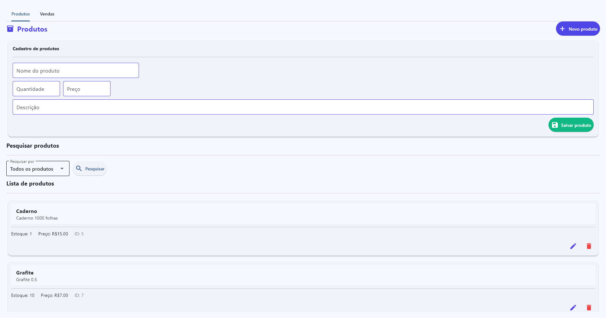
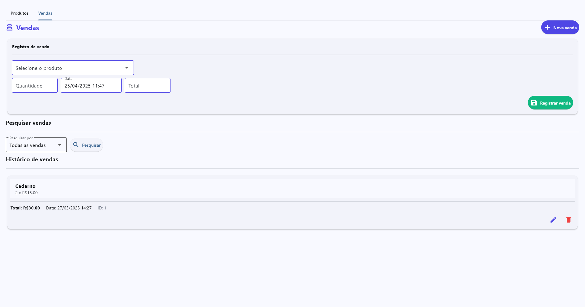

# 🛒 Gerenciador de Produtos e Vendas




Sistema completo para gerenciamento de estoque e vendas, com interface moderna e banco de dados SQLite integrado.

## ✨ Funcionalidades
- **Gestão de Produtos**:
  - Cadastro completo (nome, descrição, quantidade, preço)
  - Pesquisa por ID, nome, descrição, quantidade ou preço
  - Controle de estoque automático
- **Gestão de Vendas**:
  - Registro de vendas com data/hora
  - Cálculo automático de valores
  - Histórico completo de transações
- **Interface Intuitiva**:
  - Abas separadas para produtos e vendas
  - Cards interativos
  - Validação de dados em tempo real

## 🛠️ Tecnologias
- **Python**: Lógica de negócios e integração com banco de dados
- **SQLite**: Armazenamento persistente de dados
- **Flet**: Framework moderno para interface gráfica
- **POO**: Design orientado a objetos com classes especializadas

## 🚀 Como Executar
1. **Pré-requisitos**:
   ```bash
   pip install flet
